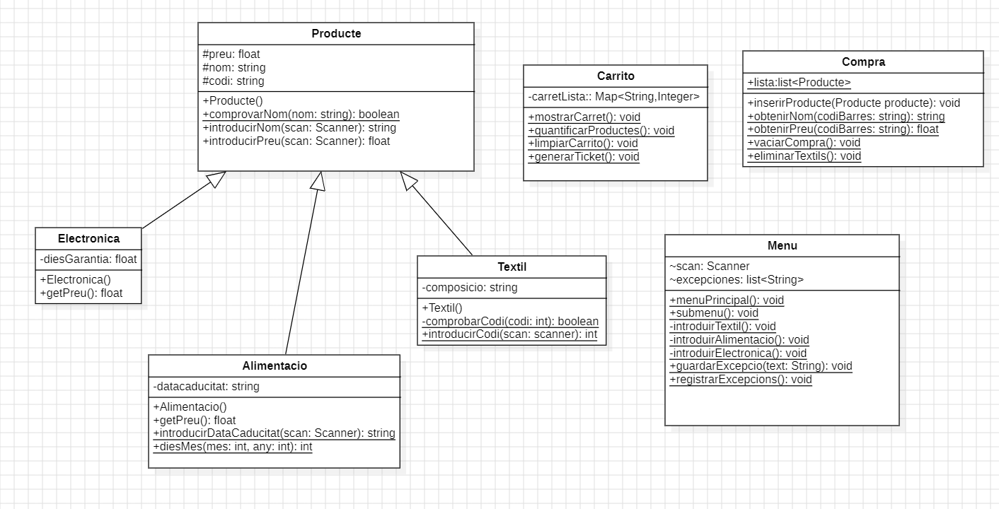
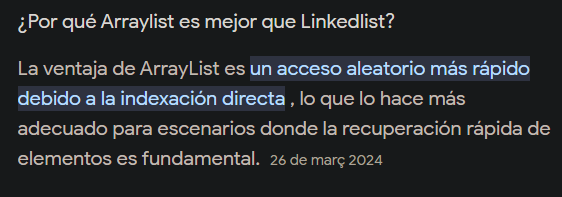

Este es un proyecto que emula un supermercado sencillo en el que se puede agregar productos a la cesta, 
mostrar el carrito y pasar por caja. 

Ademas de poner en practica el uso del sistema de ficheros, registrando excepciones en el archivo [Exceptions.dat](logs%2FExceptions.dat)
y leyendo actualizaciones de precios de productos textiles en [UpdateTextilPrices.dat](updates%2FUpdateTextilPrices.dat)

---
<!-- TOC -->
  * [Como ejecutar el programa](#como-ejecutar-el-programa)
* [Desarrollo](#desarrollo)
    * [Clase Main 🚩](#clase-main-)
    * [Clase Menu 🟰](#clase-menu-)
    * [Clase Compra  🛍️](#clase-compra-)
    * [Clase Carrito 🛒](#clase-carrito-)
<!-- TOC -->

---

## Como ejecutar el programa

`⚠️ Hay que tener instalado java para poder ejecutar`

1. Descargar la carpeta [SAPAMERCAT_jar](out%2Fartifacts%2FSAPAMERCAT_jar)
2. Entrar en la carpeta y abrir un terminal ahí
3. Ejecutar
   ```java
    java -jar SAPAMERCAT.jar
    ```
4. Interactuar con el programa

#  Desarrollo

---

Lo primero que hice cuando comencé a trabajar en el proyecto fue el diagrama de clases. Durante el desarrollo sufrió un par de cambios y al final quedó de esta manera:



Mi intención era tener todo perfectamente separado para que a la hora de buscar métodos o funciones siempre se supiera en qué clase buscar. De manera que si yo necesitaba encontrar algo que tuviese que ver con el carrito, por ejemplo, simplemente buscase en dicha clase

### Clase Main 🚩
```JAVA
        public class Main {  
        public static void main(final String[] args) {  
            // Dar la bienvenida solo cuando se inicia el programa  
      System.out.println("BENVINGUT AL SAPAMERCAT");  
      // registro de excepciones que puedan surgir y no esten tratadas dentro de la aplicacion  
      try {  
                Menu.menuPrincipal();  
      } catch (Exception e) {  
                Menu.guardarExcepcio(e.toString());  
      }  
        }  
    }
```
Decidí hacer la clase main separada del resto de la aplicación por dos motivos fundamentales:

1. Para poder dar la bienvenida al supermercado solo al iniciar la
   aplicación
2. Para gestionar todas las excepciones que no se hayan contemplado en
   la ejecución del programa

### Clase Menu 🟰

Decidí que la mejor manera de gestionar los diferentes menús, sin afectar la legibilidad del codigo, era usando dos funciones separadas:

```JAVA
/**
 * Funcion que se encarga de gestionar las acciones principales del programa
 */
public static void menuPrincipal(){}
/**
 * funcion que gestiona la introduccion de productos en el programa
 */
public static void submenu(){}
 
```
En el caso de la clase ``` submenu() ``` dentro se llama a cada una de las funciones que se encargan de escanear y comprobar la introducción de atributos  de cada producto.

```JAVA
opcio= utilities.introducirNumeroEntero(scan, 3, 0, false);
switch (opcio){
        case 1:
           System.out.println("Afergir aliment");
           introduirAlimentacio();
        break;
        case 2:
           System.out.println("Afegir Textil");
           introduirTextil();
        break;
        case 3:
           System.out.println("Afegir electrònica");
           introduirElectronica();
        break;
        case 0:
           menuPrincipal();
           break;
}         

```
Decidí que esto fuera de esta manera porque luego dentro de ellas podría llamar a los distintos métodos propios de cada clase que se encargarían de asegurar que todos los datos pasados al constructor fuesen validos al 100% y así minimizar excepciones. 

```JAVA
private static void introduirAlimentacio(){  
  String nom;  
  String dataCaducitat;  
  float preu;  
  int codiB;  
  
  nom=Producte.introducirNom(scan);  
  preu=Producte.introducirPreu(scan);  
  codiB=utilities.introducirNumeroEntero(scan,"Codi no valid","Codi de Barres: ");  
  dataCaducitat=Alimentacio.introducirDataCaducitat(scan);  
  
  try {  
        Compra.inserirProducte(new Alimentacio(preu,nom,"A"+codiB,dataCaducitat));  
  }catch (Exception e){  
        guardarExcepcio(e.toString());  
  }  
  
}
```
Todos los métodos son medianamente similares en cuanto a estructura. En cuanto al método ```utilities.introducirNumeroEntero(scan,"Codi no valid","Codi de Barres: "); ```  forma parte de una libreria creé en la UF pasada y que importé dentro de la carpeta ```📁librerias```.

En esta misma clase también puse los métodos que gestionan las excepciones y el archivo ```📄Exceptions.dat```.

Decidí que la manera mas eficiente de gestionar dicho archivo era guardando cada excepción que se produjese  dentro de un arraylist

```JAVA
public static void guardarExcepcio(String texto){  
    excepciones.add(texto);  
}
```
y luego, usando otro método, registrar cada entrada de ese array de una sola vez en el archivo al _"pasar por caja"_.

Tuve en cuenta que si había cualquier problema con el archivo o la escritura del mismo, se imprimiese por pantalla dicho error al no tener otra alternativa.

```JAVA
} catch (FileNotFoundException e) {  
    System.out.println("El archivo de excepciones no existe");  
} catch (IOException e) {  
    System.out.println(e.getMessage());  // en este caso hay un throw personalizado
}
```
### Clase Compra  🛍️

Decidí hacer una clase compra para gestionar por separado todo lo que tuviese que ver con los objetos producto y sus atributos. Por este motivo en esta clase tengo la lista con todo lo que el usuario introduce y métodos que me buscan propiedades como el nombre o el precio.

Preferí utilizar un arraylist en lugar de un linkedlist porque este me permite acceder a un elemento por su índice  y es  mas rápido a la hora de obtener objetos concretos.


### Clase Carrito 🛒

En esta clase se gestiona todo lo que tiene que ver con el carrito, por lo que hay varias expresiones lambda para el recorrido de datos

En esta clase se gestiona todo lo que tiene que ver con el carrito, por lo que hay varias expresiones lambda para el recorrido de datos

la funcion ``` quantificarProductes()``` es fundamental para el funcionamiento del programa por dos motivos:

1. Se encarga de gestionar los updates que pueda haber en cuanto al precio de los productos Textiles y sus excepciones, eliminandolos en caso de que no se puedan verificar los precios

     ```JAVA
       // filtro las instancias de textil y compruebo si este producto especifico hay que actulizarlo o no  
      Compra.getLista().stream().filter(p -> p instanceof Textil)  
              .forEach(textil -> {  
                      for (String[] linea : lineas) {  
                          if (textil.getCodi().equals(linea[0])) {  
                              textil.setPreu(Float.parseFloat(linea[1]));  
                           }  
                      }  
                  }  
              );
    ```
2. Se encarga de llenar el hashmap ``` carretLista``` con el nombre del producto y la cantidad que hay de cada uno en la compra

```java 
  carretLista= Compra.getLista().stream()  
	   .collect(Collectors.groupingBy(Producte::getCodi,Collectors.summingInt(p -> 1)));
```
Ademas se encuentra aqui la funcion para mostrar el carrito, que tambien usa las expresiones lambda para recorrer el hashmap:

```JAVA
public static void mostrarCarret(){  
// contar cuantos productos de cada uno tiene el arraylist de la compra y llenar el hashmap  
  quantificarProductes();  
  
  // codigo sin usar expresiones lambda para mostrar los productos y la cantidad que hay en la compra  
//        for (String item : carretLista.keySet()) {  
//            System.out.printf("%s -> %d\n",Compra.obtenirNom(item),carretLista.get(item));  
//        }  
  
 // codigo refactorizado para usar una expresion lambda  
 carretLista.forEach((key,item) -> System.out.printf("%s -> %d\n",Compra.obtenirNom(key),carretLista.get(key)));  
  }
```
y desde esta clase se vacían tanto el hashmap como el arraylist.

```JAVA
public static void limpiarCarrito(){  
    carretLista.clear();  
    Compra.vaciarCompra();  
}
```
